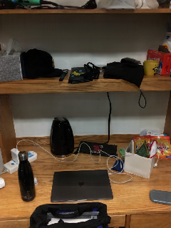

# Flash Image Enhancement via Ratio-Log Translation to Ambient Images

To cope with the challenges that low-light conditions produce in images,
photographers usually use the light provided by the camera flash, thus get-
ting better illumination on the scene. Nevertheless, non-uniform illumina-
tion, very bright regions, or harsh shadows may arise by using the camera
flash, especially in low-light conditions. In contrast, ambient images, where
the light is evenly distributed, can be seen as the enhancement version of
flash images. Using a fully convolutional network we estimate the ambient
version of a given flash image. However, instead of an end-to-end model, we
propose to first estimate the ratio-log image and then estimate the ambi-
ent image using the ratio-log and flash image. Thus recovering high-quality
information, and mitigating visual artifacts. Our proposed model generates
suitable natural and uniform illumination on the FAID dataset achieving
better performance than state-of-the-art methods with SSIM = 0.662, and
PSNR = 15.77. We also analyze the components of our model and how they
affect the overall performance. Finally, we introduce a metric to measure
the similarity of naturalness of illumination between targets and outputs
images.


## Qualitative results

| Flash image | Synthetic ambient image | Ambient image |
|:---:|:---:|:---:|
||||
||||
||||
||||
||||
||||
## Prerequisites

* Linux
* Python 3.6.8
* PyTorch 1.5.0
* NVIDIA GPU + CUDA CuDNN

## Getting started

### Installation

* Clone this repo

```
git clone https://github.com/jozech/ratio-log.git
cd ratio-log
```
* Download the dataset virtual environment

```
python download_database.py
```

If you have problems with the script above, you can download it [here](https://drive.google.com/file/d/19tXbB3qG0laZT-kvibQwiLcbFdqavJcy/view?usp=sharing), then click on the download button. If you use the external URL, you have to put the *'FAIDres'* folder inside a directory called *'datasets'*. The dataset contains all images of [FAID](http://yaksoy.github.io/faid/). All images were reduced to 320x240 resolution for our experiments.

     ├─ flash-to-ambient/
     ├─ datasets/
     ├─ MATLAB_codes/ 
     ├─ train_model.py
     ├─ eval_model.py
     ├─ eval_sample.py
     ├─ download_database.py
     ├─ download_model.py
     ├─ compute_measures.py
     ├─ imgs/
     ├─ models/
     └─ tools/

* You can evaluate a model with the validation/test dataset, for 1000 epochs of training.
```
python download_model.py
python eval_model.py --model=RATIOLOG --eval_data=test --load_epoch=1000
```

* Train our model, with the default configuration.
```
python train.py --model=RATIOLOG
```

* To evaluate one single image
```
python eval_sample.py --sample_dir=FILENAME
```

If you want to know more about the hyperparameters, please see *tools/config.py*.

